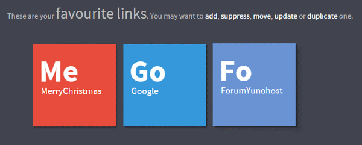

# Yunofav pour YunoHost

[](https://dash.yunohost.org/appci/app/yunofav)    
[](https://install-app.yunohost.org/?app=yunofav)

*[Read this readme in english.](./README.md)*
*[Lire ce readme en français.](./README_fr.md)*

> *Ce package vous permet d'installer Yunofav rapidement et simplement sur un serveur YunoHost.
Si vous n'avez pas YunoHost, regardez [ici](https://yunohost.org/#/install) pour savoir comment l'installer et en profiter.*

## Vue d'ensemble

Une page de liens favoris

**Version incluse :** 1.0~ynh1


## Captures d'écran



## Documentations et ressources

* Documentation YunoHost pour cette app : https://yunohost.org/app_yunofav
* Signaler un bug : https://github.com/YunoHost-Apps/yunofav_ynh/issues

## Informations pour les développeurs

Merci de faire vos pull request sur la [branche testing](https://github.com/YunoHost-Apps/yunofav_ynh/tree/testing).

Pour essayer la branche testing, procédez comme suit.
```
sudo yunohost app install https://github.com/YunoHost-Apps/yunofav_ynh/tree/testing --debug
ou
sudo yunohost app upgrade yunofav -u https://github.com/YunoHost-Apps/yunofav_ynh/tree/testing --debug
```

**Plus d'infos sur le packaging d'applications :** https://yunohost.org/packaging_apps